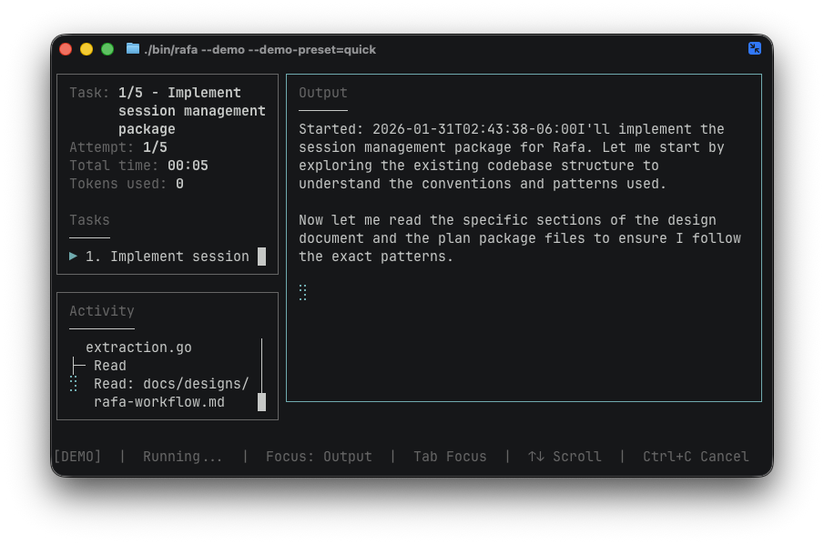

# Rafa

A task loop runner for AI coding agents. Implements Geoffrey Huntley's [Ralph Wiggum](https://ghuntley.com/ralph/) technique and Anthropic's [recommendations for long-running agents](https://www.anthropic.com/engineering/effective-harnesses-for-long-running-agents) with structure and monitoring.

## What it does

Rafa helps you implement a technical design by running AI agents in a loop until each task succeeds. You write the design, Rafa handles the execution. One agent per task at a time.



## Philosophy

You own the design. Rafa owns the execution.

New agent on every task. New agent on every retry. Agents code review and commit after each completed task. Progress is tracked. You can walk away until the loop is completed.

You only review after the complete plan is implemented.

## Status

⚠️ Experimental. Use at your own risk.

While Rafa is good at completing loops without needing user intervention, it is still giving a lot of agency to the models to make decisions. So again, use at your own risk.

The implementation can only be as good as your technical design.

## Prerequisites

- Git (repository must be initialized with `git init` if needed)
- [Claude Code](https://claude.ai/code) installed and authenticated

## Installation

```bash
curl -fsSL https://raw.githubusercontent.com/pablasso/rafa/main/scripts/install.sh | sh
```

To upgrade, run the same command again.

## Quick Start

1. Open the repository you want Rafa to operate in:

```bash
cd /path/to/your/repo
```

2. Launch the TUI:

```bash
rafa
```

3. In the TUI, use **Create Plan** to select your design document and create a plan.

> Note: Rafa requires you to already have a technical design doc created. This design is what you would do for any critical changes, right? RIGHT?
>
> If you're not used to have this back and forth with your agent, [these skills may be a good place to start](https://github.com/pablasso/skills).

4. Use **Run Plan** to execute tasks sequentially.

Rafa creates `.rafa/` automatically when you save your first plan.


## Behaviors

### Creating a Plan

Plans are stored in `.rafa/plans/<id>-<name>/` with:

- `plan.json` - Plan state and task definitions
- `progress.log` - Event log (JSON lines)
- `output.log` - Captured agent output stream

### Running a Plan

- Starts from the first pending task (skips completed ones)
- Retries failed tasks up to 5 times with fresh agent sessions
- Saves state after each task status change
- Handles Ctrl+C gracefully (resets current task to pending)

### Resuming a Plan

Select the same plan again from **Run Plan**. Rafa automatically resumes from the first incomplete task. If a task previously failed (hit max attempts), it resets to pending and continues retrying.

### Cancelling a Run

Press `Ctrl+C` during execution. Rafa will:

1. Stop the current task
2. Reset it to pending (so it resumes cleanly)
3. Save state
4. Release the lock

## Plan Structure

```
.rafa/
  plans/
    abc123-my-feature/
      plan.json        # Plan state
      progress.log     # Event log (JSON lines)
      output.log       # Captured agent output stream
      run.lock         # Lock file (exists during execution)
```

### plan.json

```json
{
  "id": "abc123",
  "name": "my-feature",
  "description": "Implement the new feature",
  "sourceFile": "docs/design.md",
  "createdAt": "2024-01-15T10:00:00Z",
  "status": "in_progress",
  "tasks": [
    {
      "id": "t01",
      "title": "Implement endpoint",
      "description": "Create the REST endpoint...",
      "acceptanceCriteria": ["Tests pass", "Endpoint returns 200"],
      "status": "completed",
      "attempts": 1
    }
  ]
}
```

## Deinitialize a Repository

Remove Rafa data from the current repository:

```bash
rm -rf .rafa/
```

## Uninstall

Remove the binary:

```bash
rm "$(command -v rafa)"
```

## License

[MIT](LICENSE)
